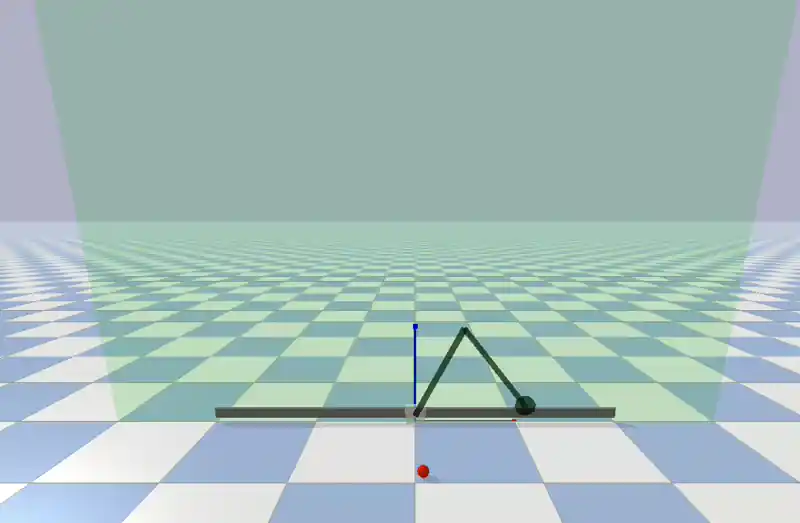

# 3-DOF MPC Ball Interceptor

A real-time projectile interception system using a 3-DOF planar robotic arm (Prismatic–Revolute–Revolute) and Model Predictive Control. The arm operates in the XZ plane and intercepts a ball thrown through full 3D space, simulated in PyBullet.



## How It Works

1. **Trajectory Estimation** — Noisy ball observations are collected over ~0.15 s and fit via least-squares regression (linear in X/Y, quadratic in Z to account for gravity). From this, the exact time $T_{cross}$ when the ball crosses the arm's operational plane ($Y = 0$) is computed analytically.

2. **Fixed-Time MPC** — A CasADi/IPOPT-based MPC solves for the minimum-effort joint trajectory that places the end-effector at the predicted interception point within the fixed time horizon $T_{cross}$. The solver uses 20 discretisation nodes, Euler-integrated double-integrator dynamics, and a hard forward-kinematics terminal constraint.

3. **Receding Horizon Control** — The MPC re-solves at 20 Hz with warm-starting (< 15 ms per solve), continuously updating the plan using live ball and robot state. A failsafe freezes the solver when time remaining drops below 0.1 s.

---

## Setup

```bash
# Clone the repo
git clone https://github.com/aceofspades07/3dof-mpc-interceptor.git
cd 3dof-mpc-interceptor

# Create and activate a virtual environment
python3 -m venv arm_env
source arm_env/bin/activate

# Install dependencies
pip install numpy pybullet casadi matplotlib
```

## Running

```bash
source arm_env/bin/activate
python intercept_ball.py
```

A PyBullet GUI window will open. A ball is spawned with a random 3D velocity, and the arm autonomously moves to intercept it as it crosses the $Y = 0$ plane.

## Key Dependencies

- [CasADi](https://web.casadi.org/) + [IPOPT](https://coin-or.github.io/Ipopt/) — nonlinear optimisation
- [PyBullet](https://pybullet.org/) — physics simulation & visualisation
- [NumPy](https://numpy.org/) — numerics & least-squares estimation
